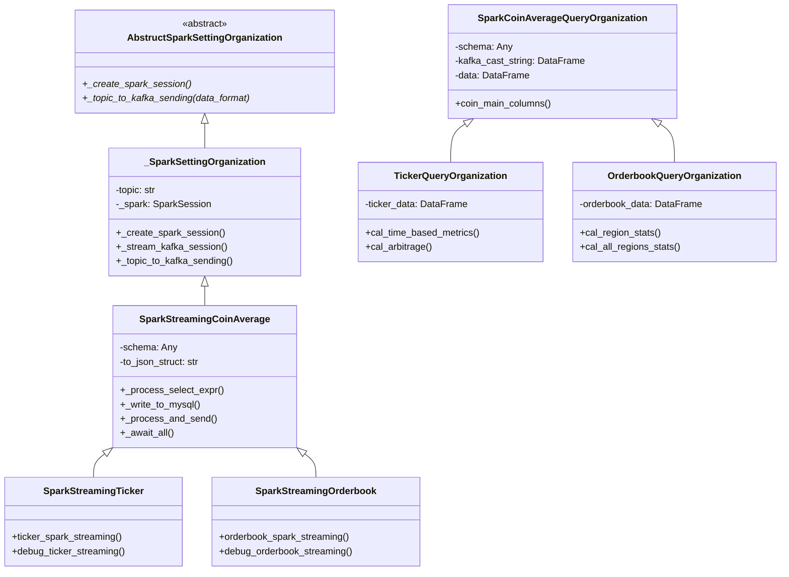

# CryptoStreamSpark

## 1. 소개

- 코인 데이터를 카프카에서 받아서 스파크에서 실시간으로 처리하는 프로젝트 입니다

## 시스템 아키텍처 


## 2. 프로세스 


## 2. 프로젝트 구조
```
 ┣ 📂 src
 ┃ ┣ 📂 config
 ┃ ┃ ┣ 🐍  properties.py          # 설정 속성 관리
 ┃ ┃ ┗ 📜 setting.conf           # 환경 설정 파일
 ┃ ┣ 📂 preprocess
 ┃ ┃ ┣ 🐍  orderbook_functions.py # 주문장 데이터 처리
 ┃ ┃ ┗ 🐍  ticker_functions.py    # 시세 데이터 처리
 ┃ ┣ 📂 schema
 ┃ ┃ ┣ 🐍  abstruct_class.py      # 추상 클래스 정의
 ┃ ┃ ┣ 🐍  data_constructure.py   # 데이터 구조 정의
 ┃ ┃ ┗ 🐍  preprocess_schema.py   # 전처리 스키마 정의
 ┃ ┣ 📂 setting
 ┃ ┃ ┣ 🐍  coin_cal_query.py      # 코인 계산 쿼리 정의
 ┃ ┃ ┗ 🐍  streaming_connection.py# 스트리밍 연결 관리
 ┃ ┗ 📂 storage
 ┃   ┗ 🐍  mysql_sink.py          # MySQL 저장 관리
 ┣ 📂 compose
 ┃ ┗ 📜 docker-compose.yml         # 도커 컴포즈 설정
 ┣ 📂 .vscode
 ┃ ┗ 📜 settings.json              # VSCode 설정
 ┣ 📜 .gitignore                     # Git 무시 파일 목록
 ┣ 🐍  coin_spark.py                  # 메인 실행 파일
 ┣ 📜 pyproject.toml                 # Poetry 프로젝트 설정
 ┣ 📜 README.md                      # 프로젝트 문서
 ┗ 🐍  requirements.txt               # 의존성 관리
```

## 3. 프로젝트 설명

CryptoStreamSpark 프로젝트는 실시간으로 코인 데이터를 처리하기 위해 설계되었습니다. 이 프로젝트는 Apache Kafka를 통해 코인 데이터를 수신하고, Apache Spark를 사용하여 데이터를 실시간으로 처리합니다. 처리된 데이터는 MySQL에 저장되며, 다양한 분석 및 쿼리를 통해 유용한 인사이트를 제공합니다.

### 주요 기능

- **실시간 데이터 스트리밍**: Kafka를 통해 수신된 데이터를 Spark로 실시간 처리.
- **데이터 저장**: 처리된 데이터를 MySQL에 저장하여 지속적인 데이터 관리.
- **데이터 분석**: 다양한 쿼리 및 분석 기능을 통해 데이터에서 인사이트 도출.
- **확장성**: 모듈화된 구조로 새로운 기능을 쉽게 추가 가능.

### 사용 기술

- **Apache Kafka**: 데이터 스트리밍 플랫폼.
- **Apache Spark**: 대규모 데이터 처리 엔진.
- **MySQL**: 관계형 데이터베이스 관리 시스템.
- **Docker**: 컨테이너화된 환경 제공.

### 설치 및 실행

1. 프로젝트를 클론합니다:
   ```bash
   git clone https://github.com/yourusername/CryptoStreamSpark.git
   ```
2. Poetry를 사용하여 의존성을 설치합니다:
   ```bash
   cat requirements.txt | xargs poetry add
   ```
